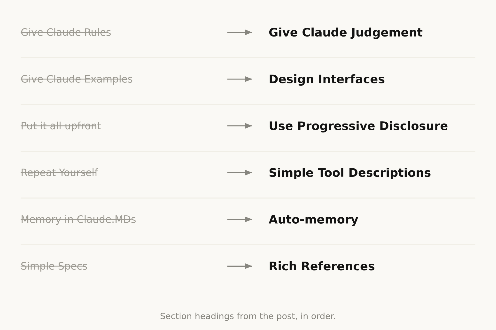

# Claude 5 世代模型的上下文工程新规则

> 我们删掉了 Claude Code 系统提示词的 80% 以上，只为了更先进的模型。以及，如何把我们学到的东西用到你自己的上下文工程里——不论是在 Claude Code 里，还是在你自己的智能体上。

我此前写过[如何最好地提示新一代 Claude 5 模型](https://claude.com/blog/a-field-guide-to-claude-fable-finding-your-unknowns)、以及如何与它们迭代着协作、把你想造的东西摸清楚。

但当你给 Claude 发一条消息时，**提示词只是它拿到的上下文里很小的一部分**。你的上下文中有很大一块是从系统提示词、Skills、CLAUDE.md 文件、记忆以及其他来源组装起来的。我们把这件事叫做[上下文工程](https://www.anthropic.com/engineering/effective-context-engineering-for-ai-agents)，它对你在使用 Claude Code、或构建自己的智能体时得到的结果影响很大。

和提示词不同，上下文会被跨很多次请求通用地使用，所以它没法写得那么具体。**当你并不知道用户的提示词会是什么的时候，怎么为 Claude 写这些通用的提示与指引？**

随着 Claude 自身能力的演进，这件事会变得出人意料地困难。最近我们注意到，为最新一代 Claude 模型写提示词的方式发生了一次大跳变：**对 Claude Opus 5、Claude Fable 5 这样的模型，我们删掉了 Claude Code 系统提示词的 80% 以上，而在我们的编码评测上没有可测量的损失。**

下面是我们关于给这一新类模型写提示词学到的东西，以及你可以怎样用它来更新自己的上下文工程。我们已经把这些最佳实践放进了 `claude doctor`；在 Claude Code 里用 `/doctor` 命令，可以给你的 skills 和 CLAUDE.md 文件"重新量体裁衣"。

## 给 Claude 松绑

总体上，我们发现**我们一直在过度约束 Claude**——既通过系统提示词，也通过 CLAUDE.md 文件和 skills。

举个例子，当我们读自己内部使用 Claude Code 的转录时，会在同一个请求里看到好几条互相冲突的消息，比如"适当留下文档"与作为系统提示词的"不要添加注释"——系统提示词、skills 与用户请求彼此打架。

一般来说 Claude 能读懂用户意图并给出正确答案，但**Claude 必须先更仔细地想清楚这些重叠且矛盾的消息，才能决定做什么**。

> 一份上下文；Claude 会读完全部内容，并且必须自己把它们调和起来。
>
> \* 图中为示意性例子，并非任何真实提示词、skill 或用户请求的逐字引用。

而且，这些约束当初是为了避免最坏情况才需要的；此后我们发现，其中很多可以删掉，**让模型改用周围的上下文与自己的判断力**。

另外，Claude Code 现在有多得多的工具。Claude 过去依赖 CLAUDE.md 作为记忆、信息与指引的来源；现在我们有了记忆（memory）、artifacts 和 skills，Claude 可以用它们创造出新的方式来跨会话加载与共享上下文。

## 过去与现在

有一批过去的上下文工程最佳实践，如今已经变成了迷思，包括：

> 文中各小节标题，按出现顺序排列。

### 过去：给 Claude 规则 → 现在：让 Claude 用判断力

我们最早推出 Claude Code 时，必须确保 Claude 避开最坏情况，比如删文件。这意味着我们会给出特别强硬的指引，哪怕它并不总是对的。例如系统提示词里我们曾经写：

> 在代码中：默认不写注释。绝不要写多段 docstring 或多行注释块——最多一行短注释。不要创建规划、决策或分析文档，除非用户要求——从对话上下文工作，而不是从中间文件工作。

但对某一部分提示词来说，这条指引是错的。以文档为例，用户可能有自己的偏好，或者特别复杂的某些代码段确实需要多行注释块。

不过，如果对更老的模型不加这些护栏，Claude 写出来的注释在很多情况下都会是错的，我们只能接受这个取舍。**而更新的模型判断力更好，不需要显式规则也能把这类决定处理好。**

新的系统提示词里我们写的是：**写出读起来像周围代码的代码：匹配它的注释密度、命名与惯用法。**

### 过去：给 Claude 示例 → 现在：设计接口

关于工具使用，过去的第一条规则是给 Claude 示例，告诉它怎么用。在我们最新的模型上，我们发现**给示例反而会把它们限制在某个特定的探索空间里**。

与其用示例，不如更多地思考你的工具、脚本与文件的**设计**——Claude 有哪些参数可用，这些参数怎样才能更有表达力？

比如在 Todo 工具的例子里，光是把 status 列成 pending、in_progress、completed 三者之间的枚举，就已经在向 Claude 暗示该怎么用它；而"保持只有一项处于 in_progress"这条指令，则界定了我们期待的行为。

> 旧版 TodoWrite 描述，与取代它的那个短接口的对比。

### 过去：全部前置 → 现在：渐进式披露

因为 Claude Code 聚焦于编码，我们的系统提示词里包含了关于如何做代码评审与验证的详细信息。这些信息**并不总是需要，但需要的时候至关重要**。

此后，Claude Code 变得非常擅长使用渐进式披露——在正确的时间加载正确的上下文。举例来说，我们把验证与代码评审移进了各自独立的 skill，Claude Code 可以选择性地调用它们。

但渐进式披露不只用于 skills，我们也把它用在**工具**上。我们的一部分工具是"延迟加载"的，意味着智能体必须先用 ToolSearch 搜索到它们的完整定义才能使用。这让我们可以拥有更多工具（比如 Task 系列工具）而**不在需要之前占用上下文**。

同样的做法也适用于你自己的 CLAUDE.md 与 Skill.md 文件。一个常见的迷思是：你想把这些文件做成一个中央仓库，把所有可能遇到的实践统统写进去，因为你觉得 Claude 否则就找不到。相反，[考虑做一棵可以在正确时间被加载的文件树](https://claude.com/blog/a-harness-for-every-task-dynamic-workflows-in-claude-code)。

### 过去：重复自己 → 现在：简单的工具描述

更早的 Claude 模型有时需要重复的指令，或者更倾向于听上下文窗口末尾而非开头的话。这导致我们的系统提示词有时既在正文里提到工具，又在工具描述里写指令。

我们发现可以删掉这些重复的示例，**把"怎么用这个工具"的指令放进工具描述，而不是系统提示词**。

### 过去：用 CLAUDE.md 存记忆 → 现在：自动记忆

我们过去鼓励用户用 `#` 热键把东西存进 Claude 的记忆，也就是自动写进他们的 CLAUDE.md。现在，**Claude 会自动保存与这项工作、与你相关的记忆**。

### 过去：简单的 spec → 现在：丰富的引用

在 plan 模式里，Claude Code 一直高度依赖装着计划的 markdown 文件。把这些计划存成文件，有助于 Claude 在需要时回看。另一个类似的最佳实践，是把 spec 存在代码库里，供 Claude 在跨越较长周期的项目中随时参考。

但我们发现，**Claude 能处理的引用可以复杂得多**。除了简单的 markdown 文件，Claude 还可以引用由我们新的 artifacts 功能创建的 HTML artifact。

你也可以**以代码的形式**给 Claude 引用。**一份 spec 也可以是一套详细的测试套件，或者另一个代码库里、Claude 可能要移植过来的一个函数。**

**Rubric（评分表）是另一种形式的引用。** Rubric 让 Claude 可以借助[动态工作流](https://claude.com/blog/a-harness-for-every-task-dynamic-workflows-in-claude-code)、带着这些 rubric 起若干验证者智能体，去尝试核对你在某个领域里的品味（比如：什么才算好的 API 设计）。

## 把它用到你自己的上下文上

把这些串起来，当你组装自己的上下文时，它应该是什么样子？

### 系统提示词

系统提示词与产品语境强绑定。它告诉 Claude 自己正运行在什么产品里、正在做什么。对 Claude Code 来说，你多半永远不会去改它；**但如果你在构建自己的 agent harness，这里正是你应该花大量时间的地方。**

### CLAUDE.md

保持你的 CLAUDE.md **轻量**，简要描述你的仓库是干什么的，**但把大部分 token 花在代码库内部的 gotcha 上**。比如，你可能把类型统一组织在一个巨大的文件里、其他地方一概没有。避免陈述那些 Claude 看一眼文件系统或仓库就该知道的"显而易见的事"。

**大量使用渐进式披露**：比如你有若干条独特的"如何验证你的工作"的指令，那就做一个验证 skill，并从 CLAUDE.md 里引用它。

### Skills

把 skills 想成**轻量的指引**，让 Claude 在需要时找得到信息。避免把它们写得过度约束，除非是在极其重要的领域。

对于很长的 skill，尽量多用渐进式披露——拆成多个文件、分开放。

**skills 最好承载的是你、你的团队或你的产品所特有的观点、知识或最佳实践。**

### 引用

你可以用 `@` 提及文件，把它们作为引用带进来。引用让 Claude 能参考关于当前计划的深入信息。

> 上下文窗口：你的提示词只是其中一片（图中各块大小仅为示意）。

这可能是 spec 文件、mockup，甚至整个代码库。**一般来说你应该优先选择以代码形式存在的文件**，因为它用一种 Claude 非常熟悉的语言，提供了清晰、高保真的指令。举例来说，**一份设计的 HTML mockup，通常会比对这个设计的一段描述或一张截图产生更好的结果。**

## 试着做减法

在你的系统提示词、skills 与 CLAUDE.md 文件上，你可能需要像我们一样做减法。我们推出了一个新命令 `claude doctor`，它也能帮你自动做这件事。关于如何为更先进的模型写提示词的更多细节，可以看我们的 [Fable field guide](https://claude.com/blog/a-field-guide-to-claude-fable-finding-your-unknowns)。

---

本文作者：Thariq Shihipar，Anthropic 技术团队成员。

---

> 译注：本文是本仓库 [references/articles.md](../references/articles.md) 中 #4（Anthropic《长时应用开发的 Harness 设计》提出的"harness 瘦身"）与 #31（Osmani 的"约束加减法纪律"）第一次拿到官方量化落地。同期 Cursor 在 #60 里描述了同向的动作——2024 年末为弥补模型能力而堆的前馈护栏"大部分早就没了"；LangChain 在 #69 里则给出了做减法所需的裁决装置（用基准决定要不要删掉 todo-list middleware 与精简系统提示词）。三家独立收敛，值得放在一起读。
