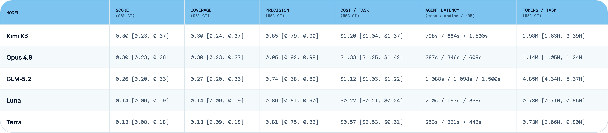
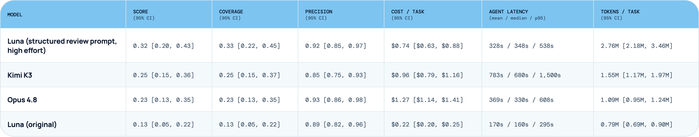

# 用 ReviewBench 评测代码评审智能体

现在市面上的代码评审智能体越来越多，我们自己也在内部造一个。但代码评审很难评测。能衡量"一个智能体在我们的评审工作流里是否有用"、而且我们信得过的基准并不多——因为它们不包含我们内部的评审标准。

我们想要一个与"评审者在真实 PR 里实际会抓出的那类问题"绑定的基准，所以造了 ReviewBench。它构建自我们 LangSmith 单体仓库（mono-repo）里的真实 PR 反馈：我们从可信评审者的评论出发，把它们策展成具体的评审问题，再转成可复现的 [Harbor](https://www.langchain.com/blog/unified-stack-for-evaluating-agents) 任务。

## 从真实评审出发

我们希望 ReviewBench 测的是评审者实际会提出的那类问题，所以从真实的评审历史出发，而不是从零手写合成 bug。

我们收集了 LangSmith 代码库中已合并 PR 上可信评审者的评论，把它们当作候选发现（candidate findings）。其中很多评论依赖代码库特有的规范，比如数据库查询缺了租户约束，或者生产环境的 cron 任务必须遵循既有的加锁模式。智能体要找出这些问题，就得从周边代码里**重建隐式的系统契约**，而不是只孤立地检查改动行。

## 把评审评论变成评测任务

我们最初的想法是直接把原始评审评论当作 ground truth 标签，但它们的噪声太大，没法直接用。有些是实质性发现，但很多只是细枝末节（nits）或提问。我们需要把原始评论收敛成一小组具体、可验证的发现。

我们只保留那些指出了"这次改动确实引入的真实问题"、且具体到足以让验证器（verifier）评判的评论。我们先让未过滤的 PR 评审过一道 LLM 闸门来标记弱候选，然后对剩下的每条评论逐一人工复核。

正是这道策展工序让 ReviewBench 作为评测有用。这个基准并不要求智能体复述可信评审者说过的每一句话，它衡量的是：智能体能否找回那些由策展后的评审者发现所代表的**实质性缺陷**。

## 一个基准问题长什么样

下面是几个具体的任务示例。

一个问题涉及一条数据库 SQL 查询：它按 ID 获取并删除资源，却没有同时校验租户。要抓住它，智能体需要认出一条项目级安全规则，并把它应用到一条具体的代码路径上。

另一个问题涉及一次端点迁移：迁移丢掉了原始 API 中存在的一个过滤器，改变了端点的行为。要抓住它，需要对比两个实现，发现这处 API 等价性回归。

这些就是我们希望 ReviewBench 能测出的问题。它们需要的不只是把改动行扫一遍、找出显眼的 bug。

## 用 Harbor 跑 ReviewBench

ReviewBench 目前有 59 个任务，覆盖 64 个基线问题。任务以 Harbor 格式编写。Harbor 给了我们一个标准的任务格式：指令、环境与验证器。我们用《[Towards Automating Eval Engineering](https://www.langchain.com/blog/towards-automating-eval-engineering)》里描述的同一套 eval-engineering 工作流，把策展好的评审问题转成 Harbor 任务。

任务开始时，智能体拿到冻结的 PR 上下文，以及"评审这个 PR"的指令。一个本地 GitHub stub 负责提供冻结的 PR 元数据和 diff，所以任务不依赖 GitHub 的实时状态。

智能体可以查看完整的种子仓库，然后提交一份结构化的发现列表，包含每个问题的位置、标题和解释。提交之后，验证器把这些发现与策展的基线问题做比对。

## 计分怎么做

ReviewBench 同时对覆盖率（coverage）和精确率（precision）计分。每个任务都有一个隐藏的验证器，用 LLM-as-judge 把智能体提交的评审与策展基线做比较。

**覆盖率**衡量智能体是否找到了基线问题。当验证器判定智能体在同一条代码路径上识别出了同一个底层问题时，该基线问题记为已覆盖。我们计分的是底层问题本身，而不是评论的措辞。

**精确率**是提交的发现中被验证器判定为正确的比例。一个发现即使不匹配任何策展的基线问题，只要有代码支撑，也可以算正确。这些额外发现计入精确率，但不增加覆盖率，也不获得单独加分。总分（headline score）是 F1——覆盖率与精确率等权。

## 结果

我们让每个模型使用同一个基础 Deep Agents harness，跑全部 59 个 ReviewBench 任务，每个任务 3 次尝试。我们刻意省去了评审专用的自定义系统提示词，让表格在同样的最小脚手架下比较各模型——提供一个共同基线，而不是测量各模型调到最优的表现。

**译注 · 图 1 数据转录**（95% 置信区间从略，见原图）：

| 模型 | Score | Coverage | Precision | 成本/任务 | 时延 mean / median / p95 | Token/任务 |
|------|-------|----------|-----------|-----------|--------------------------|-----------|
| Kimi K3 | 0.30 | 0.30 | 0.85 | $1.20 | 798s / 684s / 1,500s | 1.98M |
| Opus 4.8 | 0.30 | 0.30 | 0.95 | $1.33 | 387s / 346s / 609s | 1.14M |
| GLM-5.2 | 0.26 | 0.27 | 0.74 | $1.12 | 1,088s / 1,098s / 1,500s | 4.85M |
| Luna | 0.14 | 0.14 | 0.86 | $0.22 | 210s / 167s / 338s | 0.78M |
| Terra | 0.13 | 0.13 | 0.81 | $0.57 | 253s / 201s / 446s | 0.73M |

主要结果是：**当前模型配上一个基础 harness，仍然会漏掉大多数策展的评审者发现。** 最强的运行也只找回约 30% 的基线问题。智能体报告的问题大体是有效的，但可信评审者在真实 PR 里抓到的那些特定问题，它们仍会漏掉很多。

Luna 和 Terra 的结果比我们预期的低。翻看运行记录，它们的评审策略显得更窄：倾向于聚焦在少量发现上就停手。这压低了 token 用量和成本，却伤了覆盖率——因为很多目标问题需要看到最显眼的改动行之外。

### 换 prompt，就换结果

Luna 的结果引出一个后续问题：如果 harness 给它一套更审慎的评审策略，它会不会表现更好？

我们在 20 个 ReviewBench 任务上做了配对比较，每任务 3 次尝试。调优后的 Luna 配置使用高推理强度（high reasoning effort）和一段结构化评审 prompt；Opus 4.8 和 Kimi K3 沿用原始评审 harness。

调优配置没有给 Luna 任何新工具。和原配置一样，它可以读取和搜索仓库，但不能运行代码或 shell 命令。唯一的新东西是一段新 prompt。新 prompt 指示 Luna：先识别 PR 改了什么，再追踪周边系统如何依赖这些行为，最后对照调用方、测试和相关实现验证自己的发现。

**译注 · 图 2 数据转录**（95% 置信区间从略，见原图）：

| 配置 | Score | Coverage | Precision | 成本/任务 | 时延 mean / median / p95 | Token/任务 |
|------|-------|----------|-----------|-----------|--------------------------|-----------|
| Luna（结构化评审 prompt，high effort） | 0.32 | 0.33 | 0.92 | $0.74 | 328s / 348s / 538s | 2.76M |
| Kimi K3 | 0.25 | 0.25 | 0.85 | $0.96 | 783s / 680s / 1,500s | 1.55M |
| Opus 4.8 | 0.23 | 0.23 | 0.93 | $1.27 | 369s / 330s / 608s | 1.09M |
| Luna（原始配置） | 0.13 | 0.13 | 0.89 | $0.22 | 170s / 160s / 295s | 0.79M |

这段新的结构化评审 prompt 让 Luna 的结果发生了实质变化。在这个 20 任务切片上，Luna 拿到 0.32 的分数，高于同一批任务上使用静态评审的 Kimi 和 Opus。

**这是一次 harness 对比，不是纯粹的模型对比。** 重点在于：评审策略很重要。同一个模型，在裸 harness 下显得很弱；而当 prompt 推着它先画出改动的地图、检查可能的失效点、再提交发现时，它的表现好得多。

对代码评审智能体来说，性能提升可以来自改变"智能体怎么评审"，而不只是换模型或加更多工具。

## 接下来

ReviewBench 给了我们一个起点：用真实的 PR 反馈来评测代码评审智能体。接下来，我们想把它做得更大、更广。

我们想增加任务数量，让结果更稳定。我们也想更广地覆盖评审者在实践中会抓到的问题，包括安全约束、API 兼容性，以及需要改动行之外上下文的情况。

长期来看，我们希望 ReviewBench 能衡量：代码评审智能体能否在真实变更中找到实质性问题，同时不增加不必要的评审噪声。

---

**译者注：**

1. 与 #69（Harbor 评测栈）同源的利益相关提示：这是 LangChain 用自家基准评测跑在自家 Deep Agents harness 上的模型，且文中未说明 ReviewBench 是否开源；任务源自 LangSmith 私有单仓的评审意见，外部可复现性待观察。取方法论（真实评审意见 → LLM 闸门 + 人工策展 → 冻结环境 + 隐藏验证器），对绝对分数保持保留。
2. 文中 Luna、Terra 为模型代号，原文未说明对应哪家厂商的哪个型号，译文照录不作推断。
3. 两张结果图为表格截图，译注中的转录仅保留点估计；原图另含 95% 置信区间，比较相近分数（如 0.30 vs 0.30）时应以区间为准。
